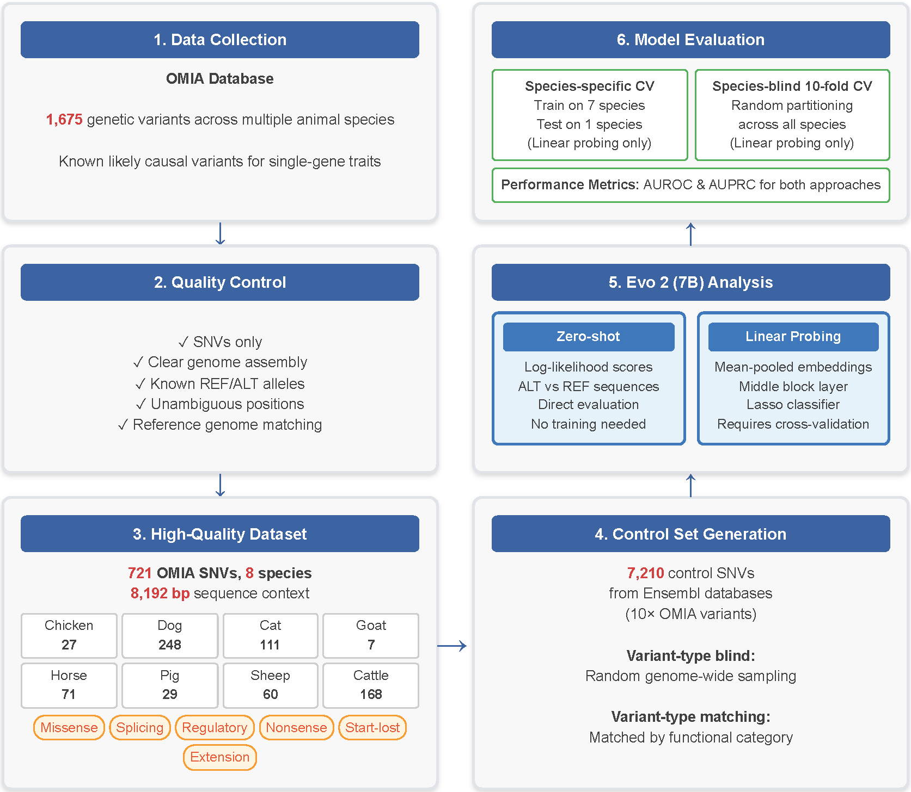

# Cross-species functional variant classification using Evo 2 on OMIA

## Analysis workflow

## OMIA variant processing
1. Download variants from [OMIA](https://www.omia.org/results/?search_type=advanced&result_type=variant&singlelocus=yes&characterised=yes).
2. Extract SNVs.
3. Download reference genomes.
4. Extract sequences for SNVs.

## Processed control variant data
TBA: https://doi.org/10.5061/dryad.v6wwpzh8j
